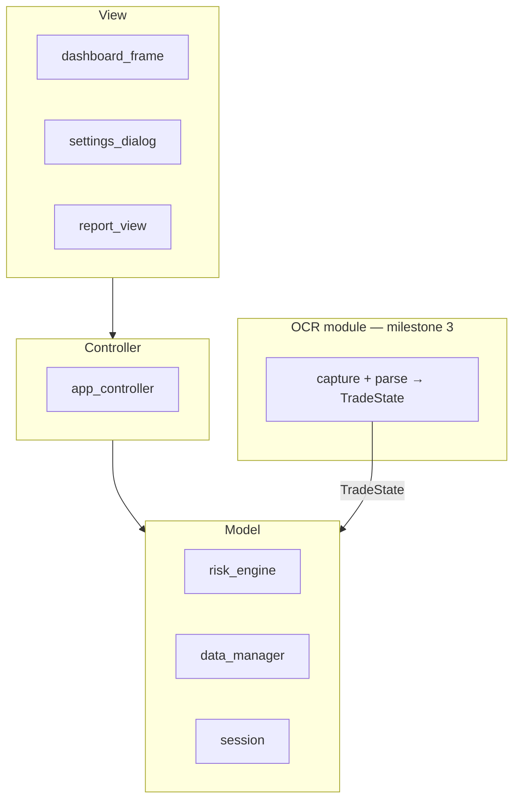
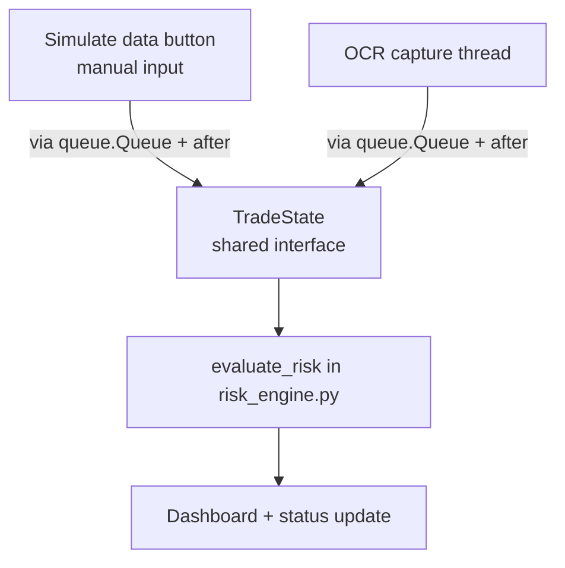
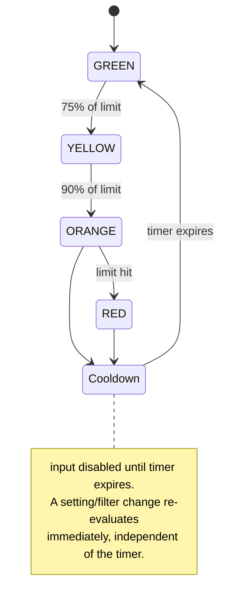
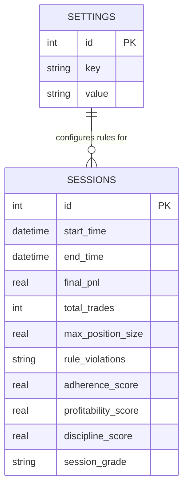

# Risk Manager — Technical Documentation

Audience: developers maintaining or extending this codebase. For end-user instructions, see `user_manual.md`. For the original planning rationale, see `risk_manager_project_plan_v3.md`.

---

## 1. Architecture Overview

MVC, with a fourth, deliberately isolated OCR module.



**Rule:** View never calls Model directly. Controller is the only layer that touches both. OCR never touches View or Controller directly — it only ever produces a `TradeState`, which enters the Model layer exactly like a manually simulated one.



This shared-interface design is the load-bearing architectural decision in the project: any future data source (e.g. a broker API feed) only needs to produce a `TradeState` to plug into the existing pipeline unchanged.

---

## 2. Module Reference

### `src/models/risk_engine.py`

**`TradeState`** (dataclass)
| Field | Type |
|---|---|
| `current_pnl` | `float` |
| `position_size` | `float` |
| `num_trades` | `int` |
| `trading_time_minutes` | `int` |
| `consecutive_losses` | `int` |

**`RiskStatus`** (Enum): `GREEN`, `YELLOW`, `ORANGE`, `RED`, `DATA_ERROR`.

**`evaluate_risk(state: TradeState, settings: dict) -> tuple[RiskStatus, list[str]]`**
Validates `state` first; any missing/invalid field returns `(DATA_ERROR, [...])` — invalid input must never silently resolve to `GREEN`. Checks P&L, trade count, consecutive losses, trading time, and position size against configured limits at 75% (YELLOW), 90% (ORANGE), and 100%+ (RED) thresholds, returning the highest severity triggered across all rules plus human-readable messages for each triggered rule.



**`calculate_discipline_score(violations, settings, final_pnl) -> dict`**
Returns `{"adherence": float, "profitability": float, "blended": float}`. See §4 for the full formula and rationale.

### `src/models/data_manager.py`

Owns all SQLite I/O. See §3 for schema. Key methods:
- `get_setting(key) -> str | None`, `save_setting(key, value)`, `get_all_settings() -> dict`
- `save_session(session_data: dict)`, `get_session_history() -> list[dict]`

`rule_violations` is JSON-encoded/decoded **only** at this boundary — every caller elsewhere works with a plain Python list. This is the single place in the codebase where that field is ever treated as a string.

### `src/models/session.py`

`Session` tracks live state during an active trading session: `start_time`, `end_time`, `active`, `trade_count`, `max_position_size`, `sum_pnl`, `violations`, `cooldown_active`, `cooldown_ends_at`. `end()` returns a summary dict shaped for direct handoff to `DataManager.save_session()`.

### `src/controllers/app_controller.py`

The only module that imports from both `views/` and `models/`. Owns the `Session`, `DataManager`, `RiskEngine` instances, wires UI events to model calls, and — for Milestone 3 — polls the OCR result queue (see §5).

### `src/ocr/` (Milestone 3 only)

`capture.py` grabs a user-configured window/region via `mss`/`pygetwindow`. `parser.py` preprocesses (grayscale → threshold → invert) and runs `pytesseract` against named ROIs, regex-extracting numeric values into a `TradeState`. On failure or low confidence, returns a failure sentinel — never a guessed value.

---

## 3. Data Model



**`settings` keys:** `daily_loss_limit`, `max_contract_size`, `max_trades_per_day`, `trading_cutoff_time`, `consecutive_loss_limit`, `cooldown_period_minutes`, `rule_severity_map` (JSON dict, rule name → `"minor"` | `"major"`).

**`sessions.rule_violations`:** JSON-encoded list of `{rule, severity, timestamp}` objects. SQLite has no native JSON column type — this is a `TEXT` column by necessity; treat it as opaque outside `data_manager.py`.

**Why adherence/profitability/blended are stored as separate columns, not just the blended score:** the UI is required to always display them separately (see §4) — a single blended number cannot be decomposed back into its components after the fact, so both must be persisted.

---

## 4. Discipline Score — formula reference

This formula was explicitly validated against how the trader wants to be evaluated (not an arbitrary default) and is locked — do not modify without an explicit sign-off, since it drives the report the trader trusts most.

**Weighting: 70% Adherence / 30% Profitability.**
Rationale: a profitable day built on broken rules is treated as a false positive, not a good outcome — the tool exists to reinforce discipline, not P&L, so discipline is weighted higher on purpose.

**Adherence (0–100):**
| Violations this session | Score |
|---|---|
| 0 | 100 |
| 1, tagged `minor` | 80 |
| 1, tagged `major` | 50 |
| 2+, any severity | 0 |

Severity per rule comes from `settings.rule_severity_map`, configured per-trader, not hardcoded.

**Profitability (0–100):**
Linear scale from `daily_loss_limit` (→ 0) to `$0` P&L / breakeven (→ 100), **capped at 100 for any P&L ≥ $0**. No additional credit is given for profit beyond breakeven — this is intentional; rewarding P&L growth in this score would reintroduce the incentive to overtrade for a higher number, which the tool exists to discourage.

```
profitability = clamp( (final_pnl - daily_loss_limit) / (0 - daily_loss_limit) * 100, 0, 100 )
```

**Blended:**
```
discipline_score = adherence * 0.7 + profitability * 0.3
```

**Reference anchors** (used as the canonical test cases in `test_risk_engine.py`):
| Scenario | Adherence | Profitability | Blended |
|---|---|---|---|
| Perfect day | 100 | 100 | 100 |
| Good day (0 violations, controlled loss) | 100 | scaled | ~75–90 |
| Mediocre day (1 minor violation) | 80 | varies | reflects 70/30 weighting |
| Bad day (1 major violation, even if profitable) | 50 | irrelevant to outcome | low regardless of P&L |

**UI contract:** every place the Discipline Score is displayed (dashboard, report, session history) must show `adherence` and `profitability` as separate labeled values alongside the blended number — the blended number alone does not tell the trader *why* a score is low.

---

## 5. Threading Model (Milestone 3)

CustomTkinter/Tkinter widgets are **not thread-safe** — they must only be touched from the main thread. `QThread` (a Qt construct, sometimes referenced in generic threading advice) does not apply to this stack.

**Correct pattern used throughout `src/ocr/`:**

1. `OCRCaptureThread` is a plain `threading.Thread`. It performs capture → preprocess → OCR → parse entirely off the main thread.
2. Its result — either a valid `TradeState` or a failure sentinel — is placed on a `queue.Queue`. The background thread never calls into any `CTk*` widget.
3. The main thread polls the queue on a timer via `.after(interval_ms, poll_fn)`, which is native to the Tkinter event loop. All UI updates happen inside `poll_fn`, on the main thread.
4. `AppController` treats a dequeued `TradeState` identically to one produced by "Simulate Data" — same `evaluate_risk()` call, same dashboard update path, no branching logic based on data source.
5. On a failure sentinel, `AppController` sets status to `DATA_ERROR` and surfaces it visibly — it never falls back to a stale or zeroed `TradeState` silently.

---

## 6. Error Handling & Logging Policy

- Standard `logging` module, `RotatingFileHandler` (5MB × 3 backups) at `logs/app.log`. No reliance on console output — the trader runs this as a packaged executable, not from a terminal.
- Every `DataManager` method wraps SQLite calls in try/except, logging enough context (which key or session id, not a generic message) to reproduce the failure.
- `evaluate_risk()` never raises on malformed input; it returns `DATA_ERROR` and logs the invalid fields.
- **General principle: fail loud toward caution, never silent toward `GREEN` or stale data.** This applies to every layer that can fail — DB writes, OCR parsing, settings loads.

---

## 7. Packaging Notes

Built with PyInstaller (`--windowed --onefile`, or `--onedir` if startup latency matters more than single-file portability — document whichever is chosen and why).

**Path resolution:** PyInstaller changes what a relative path resolves to at runtime (`sys._MEIPASS` vs the source tree). `trader_rules.db` and `logs/` must resolve to a persistent user-data directory (e.g. `%APPDATA%/RiskManager/` on Windows) determined at runtime, not a path relative to source — otherwise the database gets wiped or orphaned on every rebuild.

**Tesseract** (Milestone 3 builds only) is a system binary and is not bundled by PyInstaller automatically. Either document it as a manual install prerequisite, or bundle the binary explicitly and point `pytesseract.pytesseract.tesseract_cmd` at the bundled path.

Always test the packaged executable on a machine without the dev `venv` active before considering a build complete — packaging-specific failures (missing DLLs, broken relative paths) don't surface when testing from source.

---

## 8. Testing Strategy

| Suite | Priority | Covers |
|---|---|---|
| `test_risk_engine.py` | Highest | `evaluate_risk()` boundary cases (75/90/100% thresholds, DATA_ERROR on invalid input), Discipline Score anchors (perfect/good/mediocre/bad), profitability cap at breakeven |
| `test_data_manager.py` | High | Settings/session round-trips, `rule_violations` JSON round-trip, DB failure handling |
| `test_session.py` | Medium | Session lifecycle, cooldown timer expiry |
| `test_report_generation.py` | Medium | Report field correctness against a known session |
| `test_ocr_parser.py` | Medium (Milestone 3 only) | Extraction from synthetic sample images, failure sentinel on bad input |

`risk_engine.py` tests are written **before** any UI code, not after — it is a pure function and the highest-consequence module in the app: a bug here means the trader sees an incorrect risk status.
